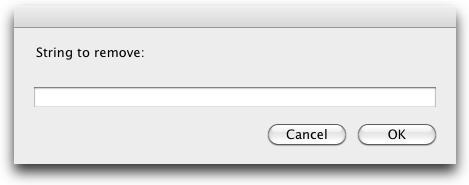

# Remove string 1.0
by Pedro Parracho <pedro.parracho@gmail.com>

## Description:
Automator workflows to remove a	fixed string for the filename of a bunch of files
 
## Install
To install you need to copy the workflows to the folder `~/Library/Services`.

##Feature
Given the string `removeThis`, it will find and remote it from the filename of selected files:  
`file_1_removeThis.txt` -> `file_1_.txt`  
`file_2_removeThis.txt` -> `file_3_.txt`  
`file_removeThis_3.txt` -> `file__3.txt`  

##Screenshot

## License

Released under MIT License